# 云原生实战

原生应用(Java、Go等一系列语言开发)上云的方案

## 云平台核心

第三方提供**公有云**，组件运维团队**私有云**

### 为什么用云平台

* 环境统一
* 按需付费
* 即开即用
* 稳定性强

* ……


#### 1.公有云

* 成本低
* 无需维护
* 无限制的缩放性
* 高可靠性
  * 可用性：N个9

#### 2.私有云

* 灵活性强：满足特定业务
* 控制力更强
* 可伸缩性更强：本地相比

三种方式：公有云、私有云和混合云

### 服务器开通

阿里云、腾讯云都有一个月的服务器试用

### 安全组设置

防火墙的设置，当需要使用某个端口，在实例中设置对应的安全组，才能开通端口的访问

### 网络知识

公网IP：外部连接使用

私网IP：内部网卡使用的IP(集群间交互)，用私网IP不会产生流量付费

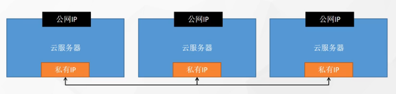

VPC：私有网络、专有网络(划分网段，随机分配)

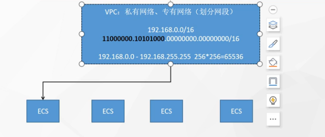

16位掩码，可以连接6w+台机器

还可以再往下创建子网(交换机)

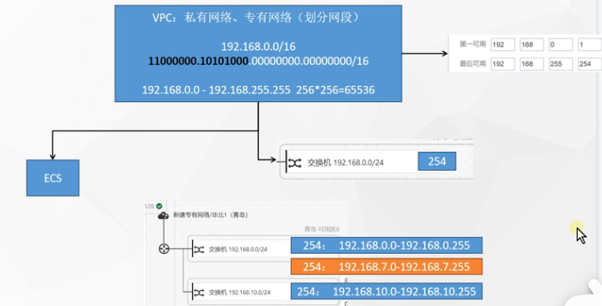

规划的网段可以用，没规划的网段不能用

划分了不同的VPC之间是隔离的(比如开发机器跟生产机器彼此隔离)


不同专有网络ping不通

## Docker

### 解决的问题

#### 1.统一标准

* 应用构建
  * Java、C++、JavaScript
  * 打成软件包
  * .exe
  * docker build...  镜像
* 应用分享
  * 所有镜像放指定地方 docker hub并下载
* 应用运行
  * 统一镜像 docker run

**虚拟化技术**

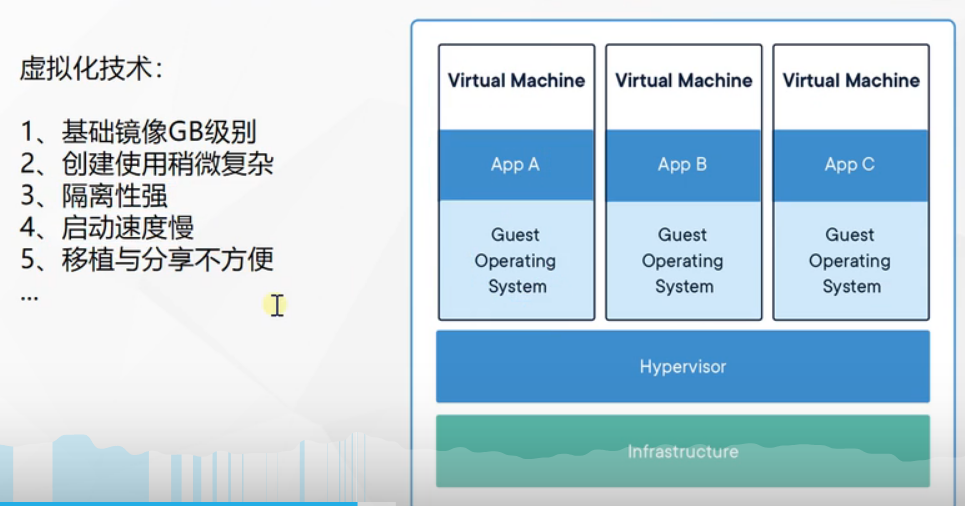

**容器化技术**

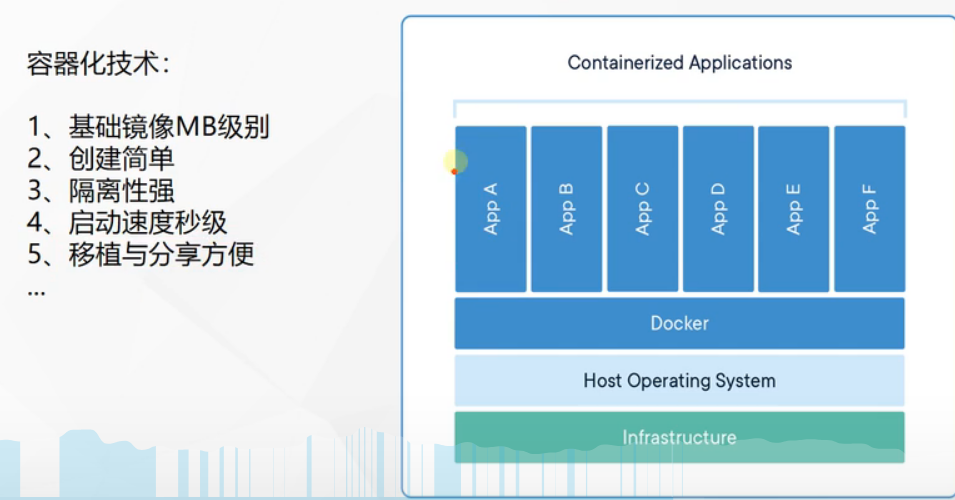

#### 2.资源隔离

* CPU、Memory资源隔离与限制
* 访问设备
* 网络
* 用户、用户组

### 架构

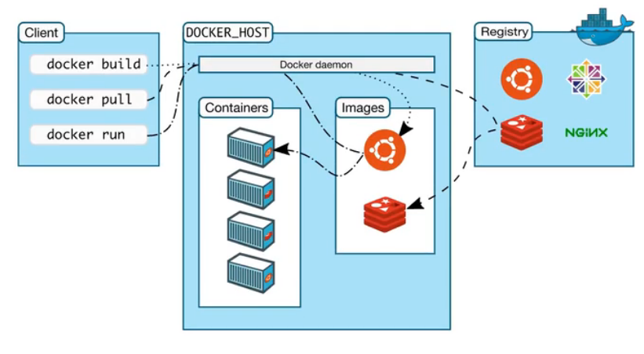

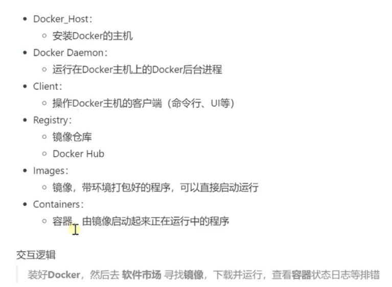

### 安装

#### 1、移除以前docker相关包

```shell
sudo yum remove docker \
                  docker-client \
                  docker-client-latest \
                  docker-common \
                  docker-latest \
                  docker-latest-logrotate \
                  docker-logrotate \
                  docker-engine
```

#### 2、配置yum源

```shell
sudo yum install -y yum-utils
sudo yum-config-manager \
--add-repo \
http://mirrors.aliyun.com/docker-ce/linux/centos/docker-ce.repo

```

#### 3、安装docker

```shell
sudo yum install -y docker-ce docker-ce-cli containerd.io


#以下是在安装k8s的时候使用
yum install -y docker-ce-20.10.7 docker-ce-cli-20.10.7  containerd.io-1.4.6
```

#### 4、启动

```shell
systemctl enable docker --now
```

#### 5、配置加速

> 这里额外添加了docker的生产环境核心配置cgroup

```shell
sudo mkdir -p /etc/docker
sudo tee /etc/docker/daemon.json <<-'EOF'
{
  "registry-mirrors": ["https://82m9ar63.mirror.aliyuncs.com"],
  "exec-opts": ["native.cgroupdriver=systemd"],
  "log-driver": "json-file",
  "log-opts": {
    "max-size": "100m"
  },
  "storage-driver": "overlay2"
}
EOF
sudo systemctl daemon-reload
sudo systemctl restart docker
```

### 命令

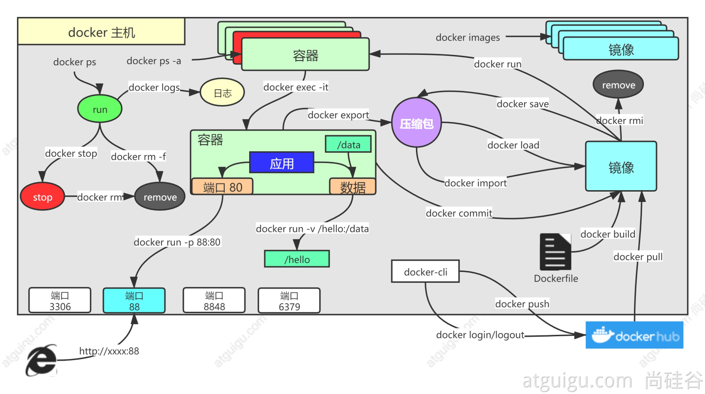

#### 1.找镜像

> 去[docker hub](http://hub.docker.com)，找到nginx镜像

```shell
docker pull nginx  #下载最新版

镜像名:版本名（标签）

docker pull nginx:1.20.1


docker pull redis  #下载最新
docker pull redis:6.2.4

## 下载来的镜像都在本地
docker images  #查看所有镜像

redis = redis:latest

docker rmi 镜像名:版本号/镜像id
```

#### 2.启动容器

> 启动nginx应用容器，并映射88端口，测试的访问

```shell
docker run [OPTIONS] IMAGE [COMMAND] [ARG...]

【docker run  设置项   镜像名  】 镜像启动运行的命令（镜像里面默认有的，一般不会写）

# -d：后台运行
# --restart=always: 开机自启
docker run --name=mynginx   -d  --restart=always -p  88:80   nginx


# 查看正在运行的容器
docker ps
# 查看所有
docker ps -a
# 删除停止的容器
docker rm  容器id/名字
docker rm -f mynginx   #强制删除正在运行中的

#停止容器
docker stop 容器id/名字
#再次启动
docker start 容器id/名字

#应用开机自启
docker update 容器id/名字 --restart=always
```

##### 端口映射

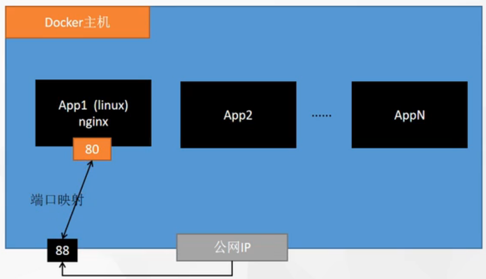

#### 3.容器内容

##### 1.进容器内部修改

```shell
# 进入容器内部的系统，修改容器内容
docker exec -it 容器id  /bin/bash
```

##### 2.挂载数据到外部修改

```shell
docker run --name=mynginx   \
-d  --restart=always \
-p  88:80 -v /data/html:/usr/share/nginx/html:ro  \
nginx

# 修改页面只需要去 主机的 /data/html
```

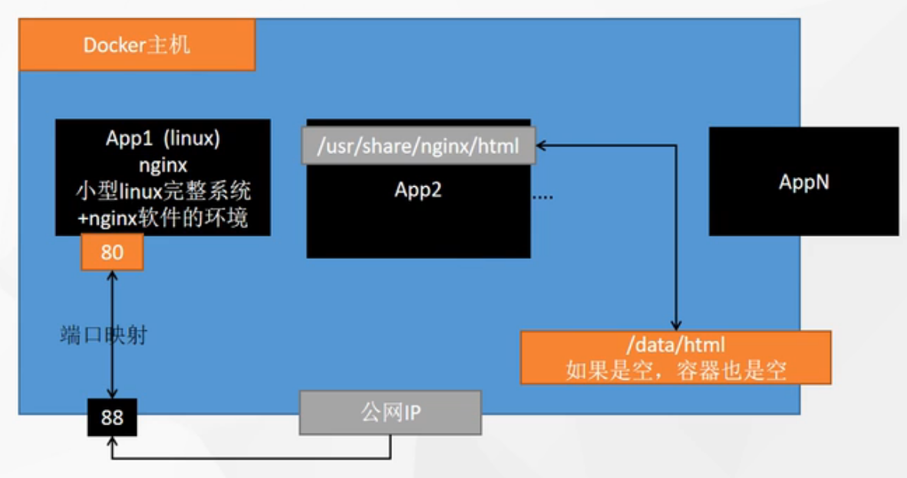

#### 4.提交改变

```shell
docker commit [OPTIONS] CONTAINER [REPOSITORY[:TAG]]

docker commit -a "leifengyang"  -m "首页变化" 341d81f7504f guignginx:v1.0

```

##### 镜像传输

```shell
# 将镜像保存成压缩包
docker save -o abc.tar guignginx:v1.0

# 别的机器加载这个镜像
docker load -i abc.tar


# 离线安装
```

#### 5.推送远程仓库

```shell
docker tag local-image:tagname new-repo:tagname
docker push new-repo:tagname
```

```shell
# 把旧镜像的名字，改成仓库要求的新版名字
docker tag guignginx:v1.0 leifengyang/guignginx:v1.0

# 登录到docker hub
docker login       


docker logout（推送完成镜像后退出）

# 推送
docker push leifengyang/guignginx:v1.0


# 别的机器下载
docker pull leifengyang/guignginx:v1.0
```

#### 6.补充

```shell
docker logs 容器名/id   排错

docker exec -it 容器id /bin/bash


# docker 经常修改nginx配置文件
docker run -d -p 80:80 \
-v /data/html:/usr/share/nginx/html:ro \
-v /data/conf/nginx.conf:/etc/nginx/nginx.conf \
--name mynginx-02 \
nginx


#把容器指定位置的东西复制出来 
docker cp 5eff66eec7e1:/etc/nginx/nginx.conf  /data/conf/nginx.conf
#把外面的内容复制到容器里面
docker cp  /data/conf/nginx.conf  5eff66eec7e1:/etc/nginx/nginx.conf
```

### 进阶实战

#### 1、编写自己的应用

编写一个HelloWorld应用

https://start.spring.io/

示例代码：  https://gitee.com/leifengyang/java-demo.git

#### 2、将应用打包成镜像

编写Dockerfile将自己的应用打包镜像

##### 1、以前

Java为例

- SpringBoot打包成可执行jar
- 把jar包上传给服务
- 服务器运行java -jar

##### 2、现在

所有机器都安装Docker，任何应用都是镜像，所有机器都可以运行

#### 4.部署中间件

```shell
docker run [OPTIONS] IMAGE [COMMAND] [ARG...]

#redis使用自定义配置文件启动

docker run -v /root/demo/data/redis/redis.conf:/etc/redis/redis.conf \
-v /root/demo/data/redis/data:/data \
-d --name myredis \
-p 6379:6379 \
redis:latest  redis-server /etc/redis/redis.conf


```

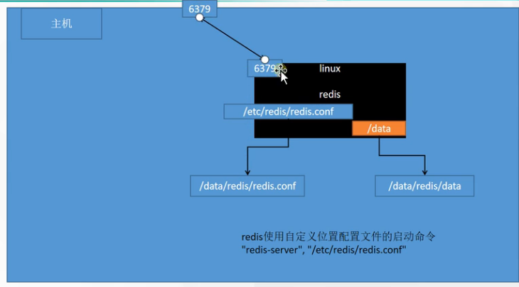

redis不设置密码容易被入侵挖矿

使用`requirepass`参数配置密码

